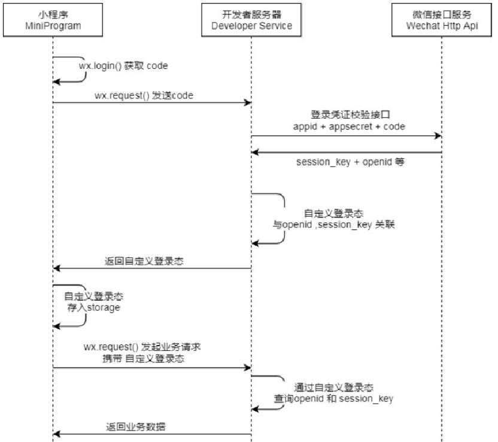

## 2025.11.06

### 密码存储

前端通过Post传递参数，避免将密码显示在URL中，后端接收密码后，与存储在数据库的哈希值对比，验证身份。

采用Argon2加密的方式：

```java
@Bean
public Argon2 createArgon2() {
    return Argon2Factory.create(Argon2Factory.Argon2Types.ARGON2id);
}
// 哈希加密
public String hashPassword(String password) {
    return createArgon2().hash(3, 1024, 1, password.toCharArray());
}
// 哈希比较(hash为数据库中的哈希值，password为前端传入密码)
public boolean verifyPassword(String password, String hash) {
    return createArgon2().verify(hash, password.toCharArray());
}
```

### 二进制文件存储

LONGBLOB/BLOB数据在后端操作中时，实际是`MultipartFile`类型，而要插入数据库和从数据库中读取时，则是以byte[]形式实现

```java
@Insert("insert into user(userID, userName, userAvatar, email, password) values(#{userID}, #{userName}, #{avatarBytes},  #{email}, #{password})")
void insertUser(String userID, String userName, byte[] avatarBytes, String email, String password);
```

`MultipartFile`的转化则借助到`MockMultipartFile`和`ClassPathResource`，使用`ClassPathResource`则是为了程序被打包成jar包后仍能从类路径中查找到指定文件（下面的例子为实现将项目中的资源转化为`MultipartFile`，**实际前端传递到后端的即是`MultipartFile`类型**）

值得一提的是，`MultipartFile`判断是否为空，使用 `multipartFile.isEmpty()`方法

```java
// 1. 从 classpath 加载文件
ClassPathResource resource = new ClassPathResource("static/images/" + filename);
// 2. 获取输入流
try(InputStream inputStream = resource.getInputStream();) {
    // 3. 创建 MultipartFile 对象
    MultipartFile multipartFile = new MockMultipartFile(
         "avatar", // 表单字段名或文件名
          filename,       // 原始文件名
         "image/png",    // MIME 类型
          inputStream     // 文件流
     );
    avatar = multipartFile;
}
```

### 免密登录/登录校验

免密登录常用方法：Session+Cookie、Cookie单独作用（不推荐使用）、Token

**Session+Cookie**：第一次登录后，在Session中存储User信息 `session.setAttribute("user", username);`，客户端存储绑定Session的Cookie，内容为`SessionID`，并设置存活时间，若为长期免密，则将Session存储进数据库。

**Cookie**：直接在Cookie中存储登录信息，发送给浏览器，设置存活时间，下次带上Cookie后后端直接读取即可

**Token**：令牌免密，将登录信息等通过加密算法**加密**，生成Token字符串，访问时需要浏览器在`请求体`**主动**带上Token，后端进行验证。

Token的生成需要用到第三方依赖。Token（下面以 JWT ( Json Web Token) 为例）有三部分：

头部：说明签名算法等	载荷：存放用户信息	签名：验证数据完整性

Token有两类：JWT 不需要在服务器存储，直接密钥校验即可；Session Token（随机字符串型 Token）则需要在后端存储登录信息，Token中是随机ID，类似Session+Cookie实现

## 2025.11.07

### 过滤器及其注册

过滤器类需要实现Javax中的Filter，并重写doFilter方法，在该方法中，最好将response和request由 ServletResponse 和 ServletRequest转换为HttpServletResponse 和 HttpServletRequest，便于使用一些方法如 setStatus等。

过滤器放行时，执行：

```java
filterChain.doFilter(request, response);
```

过滤器的注册一般采用注册类（@Configuration）的方式实现

```java
    @Bean
    public FilterRegistrationBean<loginFilter> loginFilter() {
        FilterRegistrationBean<loginFilter> registrationBean = new FilterRegistrationBean<>();
        registrationBean.setFilter(new loginFilter());
        // 过滤器作用路径
        registrationBean.addUrlPatterns("/comment/add");
        // 执行顺序
        registrationBean.setOrder(1);
        return registrationBean;
    }
```

### 登录验证

和11.06记录一样，当用户登录后，创建Session对象，`session.setAttribute("user", email);`，SpringBoot会自动生成JSESSIONID并返回给浏览器，下次访问时会自动读取JSESSIONID，查找对应Session，即可实现登录（临时）。

```java
// 检验Session
if (request.getSession().getAttribute("user") != null) {
            filterChain.doFilter(request, response);
```

## 2025.11.08

### 二进制文件的传递

JSON中无法直接存储MultipartFile文件、byte[]，若要用json来直接传递文件（如png），可以将字节数组转换为Base64字符串，再封装进JSON中

```java
String base64String;
base64String = Base64.getEncoder.encodeToString(imgBytes);
// imgBytes类型为 byte[]
```

<font color='red'>**但实际开发中，数据库中只会存储文件路径，而不是直接存储二进制文件本身！！！**</font>

### JSON的封装

json的封装有多种方式，现介绍jakson封装json的基本用法

```java
// 创建ObjectNode对象
ObjectNode jsonNode = (ObjectNode) objectMapper.createObjectNode();

// ObjectNode的put方法用于存入基本数据类型的键值对，如下方的name属性对应的就是一个String
jsonNode.put("name" : "tc");

ObjectNode sonNode = (ObjectNode) objectMapper.createObjectNode();

//set方法用于向json中嵌套一个json对象，支持的类型为 JsonNode及其子类（ObjectNode就是抽象类JsonNode的子类）
jsonNode.set("sonNode" : sonNode);
```

## 2025.11.12

### BIO、NIO、netty

BIO（blocking IO）：第一代IO，阻塞式，每次IO都需要单独开启一个线程，效率差

NIO（non-blocking IO）：非阻塞，基于事件，一个线程可以管理多个IO操作


[NIO详解](https://blog.csdn.net/qq_33807380/article/details/134190775?ops_request_misc=%257B%2522request%255Fid%2522%253A%2522f40eab8d3186068505f3c7ec86c68279%2522%252C%2522scm%2522%253A%252220140713.130102334..%2522%257D&request_id=f40eab8d3186068505f3c7ec86c68279&biz_id=0&utm_medium=distribute.pc_search_result.none-task-blog-2~all~top_positive~default-1-134190775-null-null.142^v102^control&utm_term=NIO&spm=1018.2226.3001.4187)

netty则是基于NIO开发的异步网络框架，用于取代原生Socket，高并发、性能更高

## 2025.11.25

### webSocket协议

webSocket协议也基于tcp协议，同时握手阶段使用http协议，即客户端使用http协议发起请求，若支持ws协议，会切换为websocket协议进行通信（由服务器主导）。

webSocket协议与http协议的对比：

webSocket是全双工、长连接通信，建立连接后可以长期使用，且支持服务器主动向客户端发送响应（或者说通信，毕竟客户端没有主动发起请求）。而传统HTTP协议虽然在HTTP2、3中也支持长连接，但始终是客户端向服务器发送请求后服务器再发送响应的**`轮询`**。

WebSocket 的其他特点包括：
（1）建立在 TCP 协议之上，服务器端的实现比较容易。
（2）与 HTTP 协议有着良好的兼容性。默认端口也是80和443，并且握手阶段采用 HTTP 协议，因此握手时不容易屏蔽，能通过各种 HTTP 代理服务器。
（3）数据格式比较轻量，性能开销小，通信高效。
（4）可以发送文本，也可以发送二进制数据。
（5）没有同源限制，客户端可以与任意服务器通信。
（6）协议标识符是ws（如果加密，则为wss），服务器网址就是 URL。
————————————————
**原文链接：https://blog.csdn.net/m0_74436895/article/details/144331869**


### 不同协议的协商

（由HTTP1.1 升级为不同协议）：

| 协议              | 协商方式         | 说明                                                   |
| ----------------- | ---------------- | ------------------------------------------------------ |
| HTTP/1.0 → 1.1    | 无协商           | 浏览器默认 1.1，服务器一般都支持                       |
| HTTP/1.1 → HTTP/2 | TLS ALPN（主流） | 在 TLS 握手阶段协商                                    |
| HTTP/2 → HTTP/3   | Alt-Svc          | 服务器通过响应头告诉客户端，客户端下次访问用 h3        |
| WebSocket         | HTTP Upgrade     | 通过 HTTP/1.1 头部升级（请求中加入Upgrade: websocket） |

HTTP1.1 到 HTTP2 / 3

```

【客户端】                           【服务器】
   |----- ClientHello(ALPN: h2, http/1.1) ---->|
   |<---- ServerHello(ALPN: h2 或 http/1.1) ---|
   (决定是否启用 HTTP/2)
   |-------------- HTTP 请求 ------------------>|
   |<------------- HTTP 响应 -------------------|
     （如果服务器支持HTTP/3，这里会返回Alt-Svc）
     
 下次访问时：
 尝试 QUIC(HTTP/3)
   |------- QUIC ClientHello ---------->|
   |<------ QUIC ServerHello -----------|
如果成功则用 HTTP/3，否则继续使用 HTTP/2/HTTP/1.1

```

## 2025.11.26

### JWT令牌实现登录校验

```css
JWT的构成
header.payload.signature

1. header    指明使用的签名算法 如HMAC + SHA256 ； token类型，一般是JWT
2. payload   负载，header 和 payload 都是 Base64URL 编码的 JSON，payload用来存储令牌保存的信息
3. signature 签名，signature是header + payload用签名算法使用secretKey（密钥）加密后的结构
```

signature（签名）的生成

```makefile
signature = HMACSHA256(
    Base64UrlEncode(header) + "." + Base64UrlEncode(payload),
    secretKey
)
```

JWT令牌的生成、解析代码

```java
package com.example.jwt;

import io.jsonwebtoken.*;
import java.util.Date;
import java.util.Map;

public class JwtUtil {

    /**
     * 生成 JWT
     * @param claims 自定义信息，例如 userId、username
     * @param secretKey 密钥
     * @param ttlMillis 过期时间（毫秒）
     * @return JWT token
     */
    public static String generateToken(Map<String, Object> claims, String secretKey, long ttlMillis) {
        long nowMillis = System.currentTimeMillis();
        Date now = new Date(nowMillis);

        JwtBuilder builder = Jwts.builder()
                .setClaims(claims)
                .setIssuedAt(now)
                .signWith(SignatureAlgorithm.HS256, secretKey);

        if (ttlMillis > 0) {
            Date exp = new Date(nowMillis + ttlMillis);
            builder.setExpiration(exp);
        }

        return builder.compact();
    }

    /**
     * 解析 JWT
     * @param token JWT token
     * @param secretKey 密钥
     * @return Claims 中包含 payload 的信息
     * @throws ExpiredJwtException token过期
     * @throws SignatureException token签名校验失败
     * @throws MalformedJwtException token格式错误
     */
    public static Claims parseToken(String token, String secretKey) throws ExpiredJwtException,
            SignatureException, MalformedJwtException {
        return Jwts.parser()
                .setSigningKey(secretKey)
                .parseClaimsJws(token)
                .getBody();
    }
}

```

## 2025.11.27

### pageHelper

Mybatis的分页工具，通过PageHelper.startPage方法可以自动给下一个SQL查询语句添加 limit 限制子句，参数为`页数`，`每页数据条数`

注意：pageHelper自动添加 limit 后的查询语句返回的是`Page<>`，是 List<> 子类，可用于获取关于分页的元数据。

```java
PageHelper.startPage(dishPageQueryDTO.getPage(), dishPageQueryDTO.getPageSize());
Page<DishVO> page=dishMapper.pageQuery(dishPageQueryDTO);
```


### ThreadLocal

ThreadLocal是一个线程局部变量工具类，为每个变量创建独立的变量，用于传递数据。

实现原理：每个Thread中都维护了一个ThreadLocalMap（类似HashMap，使用方法类似Redis），每次线程使用ThreadLocal.set()方法时，实际上是将ThreadLocal和对应的数据存入了该线程的ThreadLcoalMap中，让这个变量可以在线程的整个生命周期中被访问。

注意：每个ThreadLocal都只能存储一个变量，若要存储多条数据应该将其封装为对象，再将对象存入ThreadLocal中。

提供ThreadLocal，可以实现公共字段的统一管理，而不需要每次方法时都再获取一次。举例：若多个 Service 中都需要从JWT令牌中获取用户ID等字段，每次都通过请求体获取令牌并解析，这样就很麻烦，所以直接在拦截器中获取并存入该线程的ThreadLocal中，后续操作可以直接调用。

```java
try {
    //.................
    Claims claims = JwtUtil.parseJWT(jwtProperties.getAdminSecretKey(), token);
    Long empId = Long.valueOf(claims.get(JwtClaimsConstant.EMP_ID).toString());
    log.info("当前员工id：", empId);
    /////将用户id存储到ThreadLocal////////
    BaseContext.setCurrentId(empId);
    ////////////////////////////////////
    //3、通过，放行
    return true;
} catch (Exception ex) {
    //......................
}
/*
BaseContext是一个上下文类，其中threadLocal是内部维护的静态ThreadLocal属性，调用setCurrentId方法时，即用这个静态属性将empId存入线程的ThreadLocalMap
*/
```

### 统一返回类型

在实际开发中，可将所有Controller方法的返回类型全部设置为一个统一的对象，便于前端解析，也便于后端封装

```java
/**
 * 后端统一返回结果
 * @param <T>
 */
@Data
public class Result<T> implements Serializable {

    private Integer code; //编码：1成功，0和其它数字为失败
    private String msg; //错误信息
    private T data; //数据

    public static <T> Result<T> success() {
        Result<T> result = new Result<T>();
        result.code = 1;
        return result;
    }

    public static <T> Result<T> success(T object) {
        Result<T> result = new Result<T>();
        result.data = object;
        result.code = 1;
        return result;
    }

    public static <T> Result<T> error(String msg) {
        Result result = new Result();
        result.msg = msg;
        result.code = 0;
        return result;
    }

}
```

实际使用时，可通过<T>泛型指定封装和返回的数据类型，也可以通过success、error方法等直接返回不同情况下的响应。

## 2025.11.29

### SpringBoot集成Redis

Redis的配置：

```yaml
spring:
  profiles:
    active: dev
  redis:
    host: ${sky.redis.host}
    port: ${sky.redis.port}
    password: ${sky.redis.password}
    database: ${sky.redis.database}
# database:指定使用Redis的哪个数据库，Redis服务启动后默认有16个数据库，编号分别是从0到15。
```

Spring Data Redis中提供了一个高度封装的类：**RedisTemplate**，对相关api进行了归类封装,将同一类型操作封装为operation接口，具体分类如下：

- ValueOperations：string数据操作
- SetOperations：set类型数据操作
- ZSetOperations：zset类型数据操作
- HashOperations：hash类型的数据操作
- ListOperations：list类型的数据操作

配置类，配置RedisTemplate：

```java
@Configuration
@Slf4j
public class RedisConfiguration {

    @Bean
    public RedisTemplate redisTemplate(RedisConnectionFactory redisConnectionFactory){
        log.info("开始创建redis模板对象...");
        RedisTemplate redisTemplate = new RedisTemplate();
        //设置redis的连接工厂对象
        redisTemplate.setConnectionFactory(redisConnectionFactory);
        //设置redis key的序列化器
        redisTemplate.setKeySerializer(new StringRedisSerializer());
        return redisTemplate;
    }
}
```

**解释说明：**

当前配置类不是必须的，因为 Spring Boot 框架会自动装配 RedisTemplate 对象，但是默认的key序列化器为

JdkSerializationRedisSerializer，导致我们存到Redis中后的数据和原始数据有差别，故设置为

StringRedisSerializer序列化器。

### HttpClient

**HttpClient作用：**

- 发送HTTP请求
- 接收响应数据

总之：HttpClient的作用就是像浏览器中的js一样向另一个服务器发送请求，解析响应并获取数据

Http发送GET请求

```java
public class HttpClientTest {

    /**
     * 测试通过httpclient发送GET方式的请求
     */
    @Test
    public void testGET() throws Exception{
        //创建httpclient对象
        CloseableHttpClient httpClient = HttpClients.createDefault();

        //创建请求对象
        HttpGet httpGet = new HttpGet("http://localhost:8080/user/shop/status");

        //发送请求，接受响应结果
        CloseableHttpResponse response = httpClient.execute(httpGet);

        //获取服务端返回的状态码
        int statusCode = response.getStatusLine().getStatusCode();
        System.out.println("服务端返回的状态码为：" + statusCode);

        HttpEntity entity = response.getEntity();
        String body = EntityUtils.toString(entity);
        System.out.println("服务端返回的数据为：" + body);

        //关闭资源
        response.close();
        httpClient.close();
    }
}
```

HttpClient发送POST请求的方法类似：

```java
public void testPOST() throws Exception{
    // 创建httpclient对象
    CloseableHttpClient httpClient = HttpClients.createDefault();

    //创建请求对象
    HttpPost httpPost = new HttpPost("http://localhost:8080/admin/employee/login");

    JSONObject jsonObject = new JSONObject();
    jsonObject.put("username","admin");
    jsonObject.put("password","123456");

    StringEntity entity = new StringEntity(jsonObject.toString());
    //指定请求编码方式
    entity.setContentEncoding("utf-8");
    //数据格式
    entity.setContentType("application/json");
    httpPost.setEntity(entity);

    //发送请求
    CloseableHttpResponse response = httpClient.execute(httpPost);

    //解析返回结果
    int statusCode = response.getStatusLine().getStatusCode();
    System.out.println("响应码为：" + statusCode);

    HttpEntity entity1 = response.getEntity();
    String body = EntityUtils.toString(entity1);
    System.out.println("响应数据为：" + body);

    //关闭资源
    response.close();
    httpClient.close();
}
```

### 微信小程序开发

**小程序开发流程**

1. 注册小程序开发账户
2. 完善小程序信息（需实名，个人类别不能使用微信支付等高级接口）
3. 使用微信小程序开发工具登录，创建项目

<font color='red'>注意：在开发时，要勾选 详情 -> 本地设置 -> 不检验合法域名 ，否则不能请求到后端服务器</font>

**小程序项目结构**

**app.js：**必须存在，主要存放小程序的逻辑代码

**app.json：**必须存在，小程序配置文件，主要存放小程序的公共配置

**app.wxss:**  非必须存在，主要存放小程序公共样式表，类似于前端的CSS样式

对小程序主体三个文件了解后，其实一个小程序又有多个页面。比如说，有商品浏览页面、购物车的页面、订单支付的页面、商品的详情页面等等。那这些页面会放在哪呢？
会存放在pages目录。

每一个page中又会有`js、json、wxss(类似web中的css层叠样式表)、wxml(类似HTML)`等文件

注意：由于小程序运行环境是微信，DOM、BOM都不能生效，但同时也会有微信独有的api供调用。wxml的语法也和HTML有一定差别

**小程序发布**

编写 -> 上传按钮 -> 微信公众平台 -> 版本管理页面 -> 提交审核

**微信登录流程图**



### UniApp

UniApp 是 **基于 Vue 的跨端开发框架**，用一套代码可以同时发布到 **小程序（微信/支付宝/百度/抖音）、H5、Android、iOS、桌面端（Web版）** 等多个平台。

**核心是用 **Vue 语法写业务逻辑**，然后编译成各端能识别的代码。**

## 2025.11.30

### Spring Cache

Spring Cache是用于自动进行缓存操作的框架，除了Redis，Spring Cache还有其他方式实现缓存，但Redis更常用。使用Redis进行自动缓存时，底层依靠Spring Data Redis实现。

总之：Spring Data Redis侧重于实现与Redis之间的交流；Spring Cache侧重于**`自动化缓存`**

1. @CachePut注解

​	作用: **方法执行后**，将方法返回值，放入缓存

​	value: 缓存的名称, 每个缓存名称下面可以有很多key

​	key: 缓存的key  ----------> 支持Spring的表达式语言SPEL语法

2. @Cacheable注解

​	作用: **在方法执行前**，spring先查看缓存中是否有数据，如果有数据，则直接返回缓存数据；若没有数据，调用方法并将方法返回值放到缓存中

（方法中一般是调用数据库查询方法，若Cacheable注解从Redis中读取不到对应数据，则再调用方法，从数据库读取数据）

​	value: 缓存的名称，每个缓存名称下面可以有多个key

​	key: 缓存的key  ----------> 支持Spring的表达式语言SPEL语法

3. @CacheEvict注解

​	作用: **调用方法后**，清理指定缓存

​	value: 缓存的名称，每个缓存名称下面可以有多个key

​	key: 缓存的key  ----------> 支持Spring的表达式语言SPEL语法

这三个注解分别实现了：缓存、读取缓存、清理缓存 三个功能

缓存：有新数据存入时，添加缓存数据

读取：高频读取数据时，先查询Redis，没有时再查询数据库

清理缓存：数据库中的数据被修改时，清理掉对应的缓存数据

## 2025.12.8

### builder模式

原始的构造方法是在方法参数中设置要实例化的类的属性，若属性较多，要调用带参数的构造方法就很不便，且可读性很差，所以诞生了builder模式，builder模式是一种链式的构造方法，例如：

```java
Computer gamingPC = Computer.builder() 
                                    .cpu("Intel i7")       // 链式调用设置属性
                                    .memory("16GB DDR4")
                                    .gpu("NVIDIA RTX 4070") 
                                    .build();
```

具体实现：   （但实际上可以使用`Lomok`的@Builder注解快速实现builder模式构造方法）

```java
public class Computer {
    // 必需属性
    private final String cpu;
    private final String memory;

    // 可选属性
    private final String storage;
    private final String gpu;
    private final String operatingSystem;

    // 1. 私有构造函数：只接受 Builder 对象作为参数
    private Computer(Builder builder) {
        this.cpu = builder.cpu;
        this.memory = builder.memory;
        this.storage = builder.storage;
        this.gpu = builder.gpu;
        this.operatingSystem = builder.operatingSystem;
    }

    // 2. 静态内部类 Builder
    public static class Builder {
        // 必需属性 (在 Builder 中也需声明)
        private final String cpu;
        private final String memory;

        // 可选属性 (有默认值或在构建时设置)
        private String storage = "256GB SSD";
        private String gpu = "Integrated";
        private String operatingSystem = "Windows";

        // Builder 的构造函数只接受必需的参数
        public Builder(String cpu, String memory) {
            this.cpu = cpu;
            this.memory = memory;
        }

        // 设置可选属性的方法 (返回 Builder 自身，实现链式调用)
        public Builder storage(String storage) {
            this.storage = storage;
            return this;
        }

        public Builder gpu(String gpu) {
            this.gpu = gpu;
            return this;
        }

        public Builder operatingSystem(String os) {
            this.operatingSystem = os;
            return this;
        }

        // 3. build() 方法：创建并返回最终的 Product 对象
        public Computer build() {
            // 可以在此处执行最终的验证
            return new Computer(this);
        }
    }

    // 省略 Getter/Setter/toString 方法...
    // ...
}
```

### Spring Task

#### Corn字符串

Corn字符串是一种表示日期的字符串，一般包含6-7个字段，【秒  分  时  天  月  星期几  年】

```css
字段 允许值 允许的特殊字符 
秒 0-59 , - * / 
分 0-59 , - * / 
小时 0-23 , - * / 
日期 1-31 , - * ? / L W C 
月份 1-12 或者 JAN-DEC , - * / 
星期 1-7 或者 SUN-SAT , - * ? / L C # 
年（可选） 留空, 1970-2099 , - * / 
————————————————
原文链接： https://blog.csdn.net/zhaoyan_personal/article/details/141854417
```

示例：

```java
*/5 * * * * ? 每隔5秒执行一次
0 */1 * * * ? 每隔1分钟执行一次
0 0 5-15 * * ? 每天5-15点整点触发
0 0/3 * * * ? 每三分钟触发一次
0 0-5 14 * * ? 在每天下午2点到下午2:05期间的每1分钟触发 
0 0/5 14 * * ? 在每天下午2点到下午2:55期间的每5分钟触发
0 0/5 14,18 * * ? 在每天下午2点到2:55期间和下午6点到6:55期间的每5分钟触发
0 0/30 9-17 * * ? 朝九晚五工作时间内每半小时
0 0 10,14,16 * * ? 每天上午10点，下午2点，4点 
```

corn字符串不需要自己手动写，[Corn字符串生成](https://cron.qqe2.com/)

## 2025.12.19

### 文件上传

前面提到文件**持久、操作、传递**分别是以**byte[]、MultiPartFile类、base64字符串 实现**的，而实际项目中，不可能将文件传过去传过来，不然会造成极大性能开销，所以文件一般是单独传递、保存，也就是OSS（如阿里云OSS），就像是保存在云服务器上，而本地数据库中保存的是存放在OSS上的url，也就是一个字符串。

文件上传流程：

<font color='red'>**前端上传文件 --> 后端公共文件上传接口 --> OSS接收返回URL --> 前端将URL保存进表单一起发送 --> 后端接收表单并持久化**</font>

当然，也可以让前端直接访问OSS进行实例化，但一般非生产环境都会让后端作为中转。

## 2025.12.21

### Spring Data Redis

集成在Spring中用于操作Redis的客户端，工作流程：

```css
application.yml(配置Redis：ip、port、password等)
			|
读取数据源，注册RedisConnectionFactory类（包含Redis数据源，单Redis时由框架自动完成）
			|
注册RedisTemplate（实际操作Redis时使用的类，注册时需要配置对应RedisFactory：指定操作的Redis、序列化方式、Jedis/Luttce）
（可同时注册多个Template，如需要采用不同序列化方式等情况时。只需要对方法加上@Bean即可）
```

也可以同时配置多个RedisFactory（若有多个Redis）

application.yml配置（此时自定义前缀）

```
spring:
  redis:
    biz:
      host: 127.0.0.1
      port: 6379
      database: 0
    risk:
      host: 127.0.0.1
      port: 6380
      database: 0

```

​			|

自定义前缀注册不同Redis的配置类

```java
// 其一
@Data
@Configuration
@ConfigurationProperties(prefix = "spring.redis.biz")
public class BizRedisProperties {
    private String host;
    private int port;
    private int database;
}
```

​			|
注册每个数据源对应的RedisConnectionFactory类

```java
@Configuration
public class MultiRedisConfig {

    @Bean("bizRedisConnectionFactory")
    public RedisConnectionFactory bizRedisConnectionFactory(
            BizRedisProperties props) {

        RedisStandaloneConfiguration config =
                new RedisStandaloneConfiguration(
                        props.getHost(),
                        props.getPort()
                );
        config.setDatabase(props.getDatabase());

        return new LettuceConnectionFactory(config);
    }

    @Bean("riskRedisConnectionFactory")
    public RedisConnectionFactory riskRedisConnectionFactory(
            RiskRedisProperties props) {

        RedisStandaloneConfiguration config =
                new RedisStandaloneConfiguration(
                        props.getHost(),
                        props.getPort()
                );
        config.setDatabase(props.getDatabase());
        
        return new LettuceConnectionFactory(config);
    }
}

```

​			|

注册RedisTemplate时使用对应的RedisConnectionFactory

```java
@Bean("bizRedisTemplate")
public RedisTemplate<String, Object> bizRedisTemplate(
        @Qualifier("bizRedisConnectionFactory")
        RedisConnectionFactory factory) {

    RedisTemplate<String, Object> template = new RedisTemplate<>();
    template.setConnectionFactory(factory);
    // KEY的序列化
    template.setKeySerializer(new StringRedisSerializer());
    // VALUE的序列化
    template.setValueSerializer(new GenericJackson2JsonRedisSerializer());
    template.setHashKeySerializer(new StringRedisSerializer());
    template.setHashValueSerializer(new GenericJackson2JsonRedisSerializer());

    template.afterPropertiesSet();
    return template;
}
```

